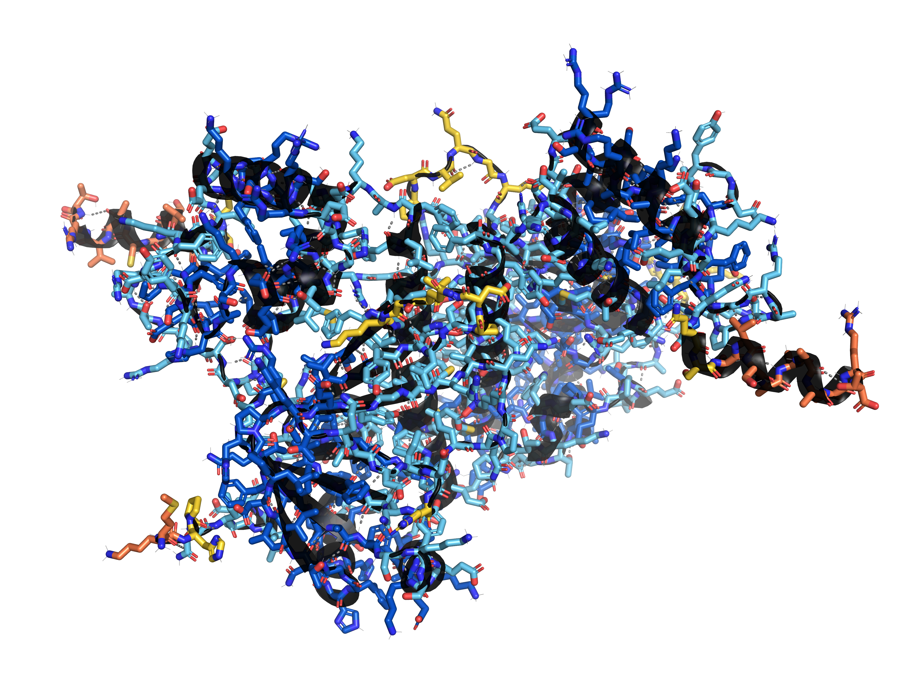
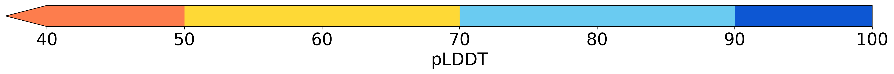

[](https://pypi.org/project/pyrosetta-viewer3d/) [](https://rosettacommons.github.io/pyrosetta_viewer3d)

<div align="left">
  
</div>
<hr>

Interactively visualize `PackedPose` objects, `Pose` objects, PDB files and PDB strings
within Jupyter Notebook, JupyterLab, and Google Colab with _py3Dmol_, _NGLview_, and _PyMOL_
backends.


<div align="center">
  
  
  <br><br>
</div>

# Description

The `viewer3d` bio-macromolecular viewer quickly renders PDB files and PDB strings,
dynamically instantiating `Pose` objects if required for certain visualization modules
(matching the object name `viewer3d.set*`). Therefore, when adding visualization modules to
the `Viewer` object or using the provided visualization presets, passing `Pose` or
`PackedPose` objects to a `Viewer` object is recommended for quicker rendering. If a `Pose`
or `PackedPose` object or iterable of `Pose` or `PackedPose` objects are provided to
`viewer3d`, the underlying `Pose`(s) pointer location(s) in memory remain fixed, and
therefore the visualization can dynamically update upon `Pose` conformational changes by
calling methods on the instantiated `Py3DmolViewer`, `NGLViewViewer`, or `PyMOLViewer`
object.

# Installation

See our official PyPI project: https://pypi.org/project/pyrosetta-viewer3d/

> [!TIP]
> For PyRosetta installation below, the U.S. West coast mirror is indicated. For the U.S. East coast mirror, use `https://graylab.jhu.edu/download/PyRosetta4/archive/release-quarterly/release.cxx11thread.serialization/` instead.

### Using _uv_:

Recommended (_py3Dmol_, _NGLview_, and _PyMOL_ backends):

```
uv pip install pyrosetta-viewer3d[all] --find-links https://west.rosettacommons.org/pyrosetta/quarterly/release.cxx11thread.serialization/
```

For _py3Dmol_-only backend:

```
uv pip install pyrosetta-viewer3d[py3dmol] --find-links https://west.rosettacommons.org/pyrosetta/quarterly/release.cxx11thread.serialization/
```

For _NGLview_-only backend:

```
uv pip install pyrosetta-viewer3d[nglview] --find-links https://west.rosettacommons.org/pyrosetta/quarterly/release.cxx11thread.serialization/
```

For _PyMOL_-only backend:

```
uv pip install pyrosetta-viewer3d[pymol] --find-links https://west.rosettacommons.org/pyrosetta/quarterly/release.cxx11thread.serialization/
```

### Using _Pixi_:

Add the PyRosetta package registry to a `pixi.toml` file:

```
[pypi-options]
find-links = [
  { url = "https://west.rosettacommons.org/pyrosetta/quarterly/release.cxx11thread.serialization/" }
]
```

then run:

`pixi add --pypi "pyrosetta-viewer3d[all]"`

### Using _Conda_/_Mamba_:

For a new environment (with the latest weekly PyRosetta release):

`conda env create -f environment.yml`

Or install into an existing environment with the latest quarterly PyRosetta release:

```
conda run -n <environment_name> python -m pip install pyrosetta-viewer3d[all] --find-links https://west.rosettacommons.org/pyrosetta/quarterly/release.cxx11thread.serialization/
```

# Documentation

See our [Official Documentation](https://rosettacommons.github.io/pyrosetta_viewer3d) site and docstrings for more information. 

# Unit Tests

To run unit tests, run the following from the Git root directory: `python -m unittest`

Also see the Git repository's GitHub Actions configs in the `.github/workflows` directory.

# PyPI Releases

Admins only:
  - Patch: `bash scripts/release.sh`

  - Minor: `bash scripts/release.sh --bump minor`

  - Major: `bash scripts/release.sh --bump major`
